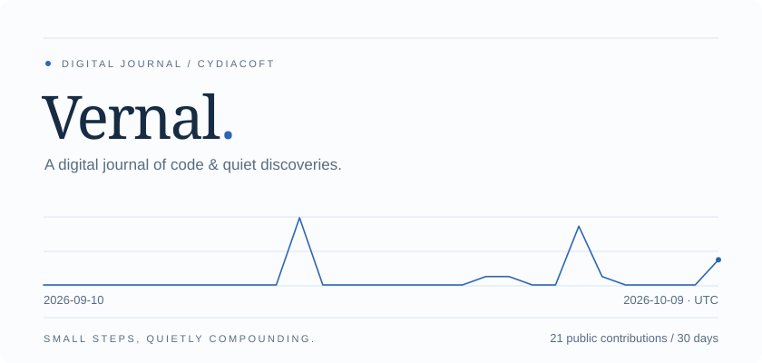

<!-- vernal:start -->
<picture>
  <source media="(prefers-color-scheme: dark)" srcset="assets/hero-dark.svg">
  <source media="(prefers-color-scheme: light)" srcset="assets/hero-light.svg">
  
</picture>

**Selected work**

[Videoder](https://github.com/Cydiacoft/Videoder) — Desktop audio & video tools · Flutter + FFmpeg  
[teaWords · 茶词](https://github.com/Cydiacoft/teaWords) — Words, translation & daily learning · Kotlin

Currently exploring · Thoughtful interfaces · Creative tools · Language &amp; learning

---

*把灵感写进代码，让日常缓缓生长。*  
Vernal / Digital Journal · Cydiacoft

<!-- vernal:end -->
